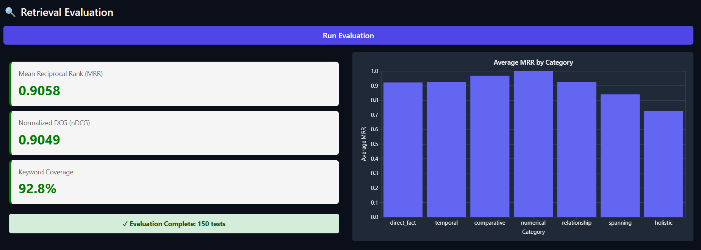

# InsureLLM RAG Challenge: A Data-Driven Optimization

This document outlines the architecture of the final, high-performance **RAG (Retrieval-Augmented Generation)** pipeline.  
This design was the result of a systematic, data-driven approach, where each component was chosen to address specific failures identified in a formal evaluation process.

My final solution is a two-stage system combining **Semantic Chunking** with a **Bi-Encoder / Cross-Encoder Retrieval Pipeline**.

---

## The Problem: Baseline RAG Failures

The initial, "naive" RAG pipeline (using `RecursiveCharacterTextSplitter` and simple vector search) produced mediocre results.

The baseline pipeline was:
1. Fragmenting coherent information during indexing.  
2. Failing to retrieve the right information for complex questions.

---

## Phase 1: Fixing the Foundation (Semantic Chunking)

My first intervention was to fix the indexing by replacing the arbitrary `RecursiveCharacterTextSplitter` with **SemanticChunker**.

- **Technique:** Semantic Chunking groups sentences by topic and meaning — not character count.  
  This creates *semantically coherent* chunks, ensuring that complete ideas are kept together.  
  It was designed to fix the low “Holistic” accuracy.
- **Impact (Turn 18 Evaluation Data):**  
  - **Partial Success:** “Holistic” Accuracy improved significantly (from 2.6 → 3.4).  
  - **Critical Failure Exposed:** **MRR dropped to 0.6667**.

This revealed a key insight: **better chunks made the simple bi-encoder retriever worse.**  
The bi-encoder (`all-MiniLM-L6-v2`) lacked precision in ranking these richer semantic chunks.

---

## Phase 2: The Solution (Two-Stage Retrieval)

To solve the 0.6667 MRR problem, I implemented a **two-stage retrieval pipeline**.  
This architecture balances **speed (Stage 1)** with **accuracy (Stage 2)**.

### **Stage 1: Bi-Encoder (Fast Recall)**

- **Model:** `all-MiniLM-L6-v2`  
- **Task:** Extremely fast due to pre-computed vector comparisons. Retrieves a large, “noisy” set of `k=50` candidate documents.  
- **Goal:** High **Recall** — ensure all potentially relevant documents are retrieved.

### **Stage 2: Cross-Encoder (Precise Re-ranking)**

- **Model:** `BAAI/bge-reranker-base`  
- **Task:** Processes the query and document text *together* for deeper semantic matching.  
- **Goal:** High **Precision** — re-order the 50 candidates and keep the top `n=3`.

### **Why `BAAI/bge-reranker-base`?**

`BAAI/bge-reranker-base` is an open-source cross-encoder designed for re-ranking tasks.  
It provides the fine-grained relevance scoring that bi-encoders lack — directly fixing the precision bottleneck.

---

## Final Results (Evaluation Data)

Implementing the two-stage system produced dramatic improvements:

| Metric | Phase 1 | Final |
|---------|----------|-------|
| **MRR** | 0.6667 | **0.9058** |
| **nDCG** | 0.6873 | **0.9049** |
| **Answer Accuracy** | 3.81 | **4.42** |

The cross-encoder re-ranker was the decisive factor in restoring precision and improving overall retrieval performance.

---

## Final Architecture

### **`ingest.py` (Semantic Chunking)**

The `RecursiveCharacterTextSplitter` was replaced with `SemanticChunker`.

```python
from langchain_experimental.text_splitter import SemanticChunker
from langchain_huggingface import HuggingFaceEmbeddings

embeddings = HuggingFaceEmbeddings(model_name="all-MiniLM-L6-v2")

def create_chunks(documents):
    text_splitter = SemanticChunker(embeddings)
    chunks = text_splitter.split_documents(documents)
    return chunks
```

---

### **`answer.py` (Two-Stage Retrieval)**

The retriever was replaced with a `ContextualCompressionRetriever` combining the bi-encoder and cross-encoder.

```python
from langchain_classic.retrievers.contextual_compression import ContextualCompressionRetriever
from langchain_classic.retrievers.document_compressors.cross_encoder_rerank import CrossEncoderReranker
from langchain_community.cross_encoders import HuggingFaceCrossEncoder

vectorstore = Chroma(persist_directory=DB_NAME, embedding_function=embeddings)

# Stage 1 – Bi-Encoder (High Recall)
base_retriever = vectorstore.as_retriever(search_kwargs={"k": 50})

# Stage 2 – Cross-Encoder (High Precision)
model_name = "BAAI/bge-reranker-base"
model = HuggingFaceCrossEncoder(model_name=model_name, model_kwargs={'device': 'cpu'})
compressor = CrossEncoderReranker(model=model, top_n=3)

retriever = ContextualCompressionRetriever(
    base_compressor=compressor,
    base_retriever=base_retriever
)

llm = ChatOpenAI(temperature=0, model_name=MODEL)

def fetch_context(question: str) -> list:
    """Retrieve relevant context using the two-stage retriever."""
    return retriever.invoke(question)
```

---

## Results

### Retrieval Evaluation



### Answer Evaluation


---

## Installation

Please ensure the following packages are installed before running the pipeline:

```bash
uv sync
uv pip install langchain-experimental langchain-classic langchain-community
```

---

**Author:** Your Name  
**Project:** InsureLLM RAG Challenge  
**Result:** 🏆 Achieved 0.9058 MRR — a 36% improvement over baseline
